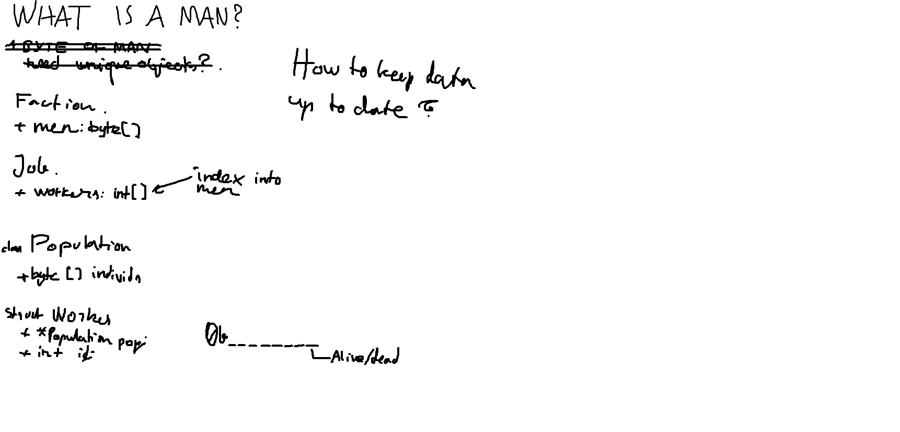

## Ressursid

Ehk esemed, materjalid. Teatud ehitised hoiustavad ressursse ning neid ressursse saab mängija igal pool kasutada. Hoiuruum on piiratud.

### Ressursiallikad

Ruudud, millele saab panna ressursse tootvaid töid. Mingid looduslikud elemendid kaardil. Ressursid saavad siin mingi hetk otsa (kuigi võivad olla vaikselt taastuvad), misjärel ruut kaob.

* Mets
	- toodang: puit
* Kivirahn
	- toodang: kivi
* Saviauk
	- toodang: savi

## Inimesed

### Andmestruktuur

Inimesi peab saama tööle panna ja töölt ära võtta. Neid võib juurde tulla ning ära minna. Õnnetuste korral peaks neid surema, ning elus püsimiseks peaks nad sööma. Nende kirjeldus mälus peaks neid tegevusi võimaldama. Lisaks on eeldus, et inimesi on mängus ühel hetkel palju (tuhandetes). Lahendus peaks ka sellega hakkama saama.

**Kui inimene on lihtsalt väärtus**:

* lihtne kujutada arvu või listina: igal tööl oma list, igal majal oma list...
* probleem: andmete õigsuse tagamine.
  * kui on eraldi listid "inimesed, kes pole tööl" ja "inimesed, kellel pole kodu", siis on kogu inimeste arv segane - kui inimesi tuleb juurde, tuleb nad lisada mõlemasse listi

**Kui iga inimene on eraldi objekt**:

* lihtne omadusi salvestada, hoida liste viidetena
* võimalik probleem: suurem mälukasutus, *cache locality* puudub
* võimalik probleem: vähem kontrolli API üle, kui on tarvis ümber kirjutada
* nullviidad

**Kui inimene on objekt sõnastikus ning ligipääs id kaudu**

* lihtne omaduste salvestamine objektidesse
* parem kontroll api ning viitade üle
* probleem: suurem mälukasutus *cache locality* puudub
* keerulisem üles seada

## Oskused

(*Skills*) oleks abstraheeritud terve koloonia populatsiooni peale. Nimekiri arvudest, mis näitavad koloonia üldist oskustaset mingis valdkonnas. Aja jooksul kõik need arvud kahaneks, sest inimesed unustavad, surevad, ning tuleb peale järjest uus põlvkond. Spetsiifilised ehitised (koolid) annaks töid, mis suurendavad oskustaset mingis valdkonnas. Loogiline oleks ka, et teised tööd seda teeksid. Mingid füüsilised ülesanded (puuraidumine) suurendaks vähe sellega seotud oskusi (puuraidumine.. metsandus?).

## Tööd

* Ehita ehitis
	- omadused:
		- ehitise andmed
	- sisendid:
		- ressursid
		- töölised
		- tööliste palk
	- väljundid:
		- ehitis kasutusvalmis
* Raiu puid
	- omadused:
		- metsa andmed
	- sisendid:
		- töölised
		- tööliste palk
	- väljundid:
		- puit
		- mets kahaneb
* Raiu kivi
	- omadused:
		- kivi andmed
	- sisendid:
		- töölised
		- palk
	- väljundid:
		- kivi (materjal)
		- kivi (ressursikoht) kahaneb
* Püüa kala
	- sisendid:
		- töölised
		- palk
	- väljundid:
		- kala