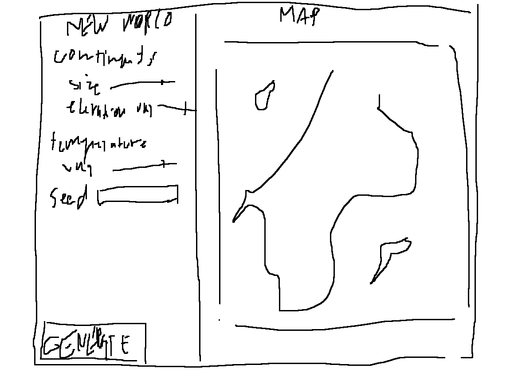

Diplomacy: each faction has values and a view of the player faction. Making business with the other requires haggling resources in a way that the other feels they get an advantage from it. So if you're super strong they'd accept a loss in trade because complying would mean that you won't attack them.

---

- [X] Limited resource space is annoying to implement. Resources should be limited through availability and creation time, not storage.
- [ ] Jobs should somehow take workers automatically, because it's hard to manage it through AI. Or come up with a good way to manage it with AI...

### Sylvester

Games are played for their emotions - usually victory/defeat/suspense (arcade games). So game mechanics should be tools to bring out emotion, create emotional situations [video]. Emotions are provoked when an action changes a human value [book]. Human values: life/death, victory/defeat, friend/stranger/enemy, wealth/poverty, low status/high status, together/alone, love/ambivalence/hatred, freedom/slavery, danger/safety, knowledge/ignorance, skilled/unskilled, healthy/sick, and follower/leader [book]. Challenge is a common way to evoke emotion [book].

| 				          | Perceived by player | Not perceived by player     |
| -------------------     | ------------------- | -----------------------     |
| **Present in game**     | Normal              | ~~Unperceived complexity~~  |
| **Not present in game** | *!Apophenia*        | Normal                      |

Apophenia: human perception of emotions and intentions in everything. Need abstracted feedback and long-term relevance (so more opportunities to tie in context with what happens).

Disproportionate responses vs skill testing. DP for a good story. Losing something in the story makes for a good story, layers of failure states that you can get deeper into.

Plan for short periods and iterate. Make a dependency stack to see what parts of the game would need to change if another part changed and for what to implement first, throw others into a "later" pile.

#### Dependency stack

(depending objects are higher, baseline objects lower)
<pre>
* L A T E R * *
* [trade] []  *
* * * * * * * *

           [..region ui..]
           | deps on many|

[mandates]<----[complex resource production]
  |                     |         |
  |  [constructing buildings]     |
  |             |     |           |
[contracts]     |   [jobs]
     |          |                 |
[regions]<[map objects]     [workers]

</pre>

### Events

- Get a mandate for a resource you don't have but a neighboring (non-colony) region does. You have to then trade or extort it from them.
-

### AI smarts

#### Getting food

Generate a GatherResourceEvent for each type of food resource provider, decision factors should be food amount and existence of these food sources. Generate a trade send job for this food (decision factors having silver and having no source ourselves) and a trade buy job (decision factors having silver, cheaper price, and being low on this food).

But if you gather all the food, there'll be no more food left !? What !? We need to grow crops..

**Example grain field**
- Create building:
  - reasonable grain field building count (should be food gotten divided by food needed orwhatever)
- Assign job to it:
  - has workers

Kui süüa vähe ja vähe toidutegemistööde peal inimesi, peaks inimesi jõuga ehk töölt maha võtma nii et ta saaks uuesti assignida. Veidi hack aga vaata, äkki töötab.

Tahaks, et AI otsiks toitu, kui seda on vähe. Toidukasutuse põhjal peaks ta vaatama, et oleks olemas mitme päeva varu. Selleks resourcewant peaks igal toiduesemel suurem olema, kui süüa vähe.

#### Trades

Decision factorid peaksid olema resource wants ja hõbeda hulk. Iga eseme kohta nii siis trade offer. Saatmine suvalisele factionile (vb mängija omale suurema tõenäosusega, et rohkem mäng oleks?)

#### Crafting chains

Seda võiks teha automaatselt. Kui resourceewant mingil lõppproduktil on kõrgem, siis alamproduktide resourcewant peaks kasvama kui seda lõppprodukti pole olemas. Gene crafting chain (ilmselt puu läbimine rekursiivselt lihtsalt), salvesta runi ajaks mällu (struktuur vist puu kus igal sõlmel viidad vanemale (lol scene tree)), kasuta seda, et leida alamaid elemente. Seo approval ratinguga need ülemate asjade resourcewantid.

Majade ehitamine peaks olema au sees kui pole eluruumi.. Aga utility on 0 kui pole materjale,. Siis majade ehitamiseks vajalikud materjalid peaks olema kõrgme resourcewantiga.

### Mida teha enne ekspot

- [ ] approval rating
  - [X] see võiks tõusta mingite esemete tekkides (nt mööbel - majadesse mööbeldamise job? tõstaks mingit statti ja approvalit)
  - [X] kukuks rängalt kui nälgimine käib
  - [X] gameover kui 0
- [ ] asju mida tarneahelates teha
  - [X] puidu laudadeks töötlemine
  - [X] terade jahuks töötlemine
  - [X] jahu leivaks töötlemine
- [ ] info
  - [X] alguses notif mängija omaniku nimest
  - [ ] ressursside nimekirjas märgend praegusest nõudmisest
  - [X] märguannete nimekiri ekraanil kogu aeg
  - [X] ribad näitamaks kui kaugel mingi mopbjecti tööga ollakse
- [X] buttons for zooming in out
- [X] prepared experience thing, like a world seed and specific region the test player will get dumped into

### Hiljem

Nüüdseks on selgunud, et gatherresourcejob ja craftjob on üsna sarnased - saaks teha nii, et resourceil on lihtsalt list töödest (olgu kumb tahes) ning neid saab mängus valida. Nii et ehitistel saaks ka olla gatherresource, mis mingil hetkel otsa saaks. Siis peaks welle salvestama ka peale töö olemasolu, ilmselt antud koordinaadil lihtsalt. Näiteks kaev (well), millest saab gatherresource vett, see saaks sellel ruudul mingi hetk otsa, peaks ehitama uue kaevu, et vett veel saada. Kui samasse kohta kaev ehitada, ei tohiks sealt vett tulla.

Sõjalises mõttes: barracks ehitis, kus töö treenida. Factionil on max militaarvõimekus, sõltub sellest, kui palju barrackse on. Treening suurendab päris võimekust kuni maxini, võimekus kukub, kui ei treenita. Suure võimekusega saaks ähvardada naabreid?

Vaja viise ,kuidas mõjutada naabrite tootmist, närb on näha kui ta ei tee telliseid kuigi sa tahaks väga ehitada pagarikoda!!!

Marketplace töötab imelikult, vist lisab kõik offerid mingilt factionilt korraga? Võiks ükshaaval. Ja kas üldse on vaja marketplace ehitist, et treide teha? Oleks hea kui ehitamise süsteemil oleks kasutusi, aga mugavuse kohapealt pole vist loogiline, et marketplace töötab nii nagu ta töötab. Äkki lihtsalt mingi treidide tabi unlockimiseks see ehitada? Vaja ka mängijale võimalus offereid saata.

Äge oleks mingeid graafikuid konstrueerida või vähemalt andmeid koguda maailma seisu kohta, mis populatsioonid-ressursid regioonidel on

Revolutsioonid: kui AI juhtimisel nulli läheb approval siis +50% approval ning muuda nime või värvi?

Rünnakud. rünnak mingi teise ruudu vastu oleks problem, mida teine peaks lahendama. Siis military number kummalgi peaks seda mõjutama.. kui liiga suur vahe, siis ei saa solvida. Aga solvivad inimesed peaks olema seotud militaryga. Military jõud siis mitte sõltuv militarys tööl olevatest inimestest vaid lihtsalt barrackside / mingite kaitsevallide olemasolust ? Military jagada offensi ja defensi vahel? Siis olekski attack job ühelt poolt ja defend job teiselt poolt, ning attack ja defend mõjutaks seda. Kas attack ja defend peaks eraldi olema, lihtsalt militaryt võrrelda ning ehitised mõistlikud välja mõelda, mis seotud üldiselt sõdimisega.

### Mida teha enne testimist

- [ ] rohkem contenti
  - [ ] building to grow trees
    - [ ] harvest tree seeds job for this
- [ ] rohkem rõhuda maailma osa olemise tundele'
- [ ] maailma genereerimise menüü koos seadetega
  
- [X] ressursiallikate eemaldamine (kui pole ruumi panna midagi kuhugi)
- [X] ehitiste eemaldamine
- [ ] info
  - [ ] logi tab kus eelmised notifid factioni koha
    - [ ] ära lihtsalt pane rtlabelisse, gene tekst nt kuu kaupa kui nuppu vajutatakse
  - [ ] mingi märguande ikoon uute treidide kohta turul
  - [ ] riba näitab kui depleted a resource site is
  - [X] tööde menüü
- [ ] targem AI
  - [X] kurvid utility arvutamiseks
  - [ ] otsiks toitu kui seda on vähe
- eventid
  - [X] kaardi peal hüüumärk koos ajalimiidiga
  - [X] pane töölisi sisse et olukorda parandada
  - võib sõltuda kohast, kus juhtub:
	- [ ] metsatulekajhu
	- [X] kalurite paat läks ümber
	- [ ]
  - teise riigi rünnak
    - [X] kõigil factionitel military = inimesed tööl barracksides
    - [ ] kaardi peal nupp sõja kuulutamiseks
    - [ ] kaardi peal nupp rahu sobitamiseksw
- [ ] juice+heli
  - [ ] ehitisi maha pannes madal heli + tolm
  - [ ] mingid inimeste particleid töökohtade juures
  - [X] kõigile nuppudele hover + click
  - [X] keskkonnahelid sõltuvalt kaamera asukohale
- [ ] muusika
- [X] seadete menüü
  - [ ]

**Parandada**:

- [X] ehitise tööd tulevad ekraanil ette kui ehitamata ehitis eemaldatakse
- [X] boonus building kirjeldusse
- [X] assert failid "empty region" annekteerimisel
- [X] edgeid pole õiged kui võtad mingi sõjas oleva riigi naaberriigi tilesid endale siis ei uuene teise edgeid sinuga
- [ ] mingi memory leak uute maailmade tegemisel
- [ ] ei saa silverit?
- [ ] ära näöita processmarketjob kui on üle ühe marketplacei

**Etc**

- [ ] enable regions switch when generate regions?
- [X] make camera flying less floaty
- [X] limit camera to edges of the world
- [X] hide hud buttons on gameover
- [X] build quarry wouhtout rocks..?
- [ ] might not notice silver switches out